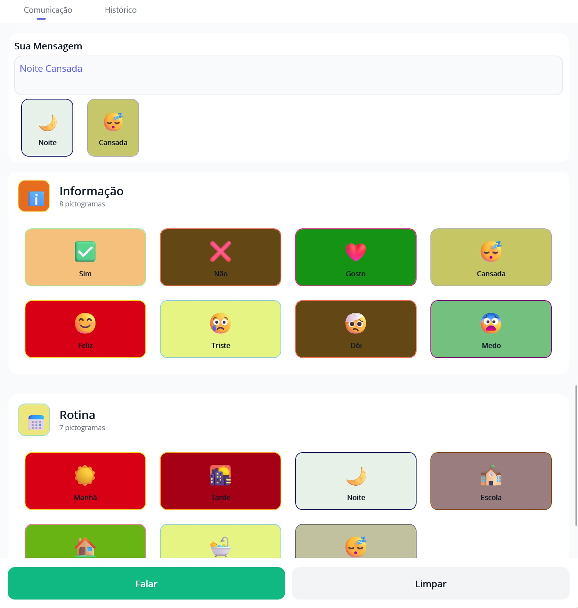

# CAA

## Sobre o projeto

O **CAA** (Comunicação Alternativa e Aumentativa) é um aplicativo desenvolvido para facilitar a comunicação de pessoas com dificuldades de fala, utilizando pictogramas e frases simples. Ele permi[...]

## Funcionalidades

- **Construção de mensagens**: O usuário pode montar frases selecionando pictogramas que representam palavras, sentimentos, ações e rotinas.
- **Categorias**: As imagens estão agrupadas em categorias como Informação (Sim, Não, Gosto, Cansada, Feliz, Triste, Dói, Medo) e Rotina (Manhã, Tarde, Noite, Escola, Casa, Banho, Cansada).
- **Interface intuitiva**: Navegação simples, com botões grandes e imagens ilustrativas, facilitando o uso por crianças e adultos.
- **Botão "Falar"**: Após montar a frase, é possível clicar em "Falar" para que o aplicativo vocalize a mensagem.
- **Histórico**: Acompanhe as mensagens enviadas.

## Público-alvo

- Pessoas com deficiência na fala ou comunicação (TEA, paralisia cerebral, síndrome de Down, etc).
- Educadores, terapeutas e familiares que desejam auxiliar na comunicação.

## Tela do aplicativo

## Como usar

1. Selecione os pictogramas que representam a frase desejada.
2. Visualize a frase construída na área "Sua Mensagem".
3. Clique em "Falar" para que o aplicativo vocalize a frase.
4. Utilize o botão "Limpar" para reiniciar a frase.

---

## Documentação Complementar

- [Guia de Deploy (DEPLOY_GUIDE.md)](CAA/DEPLOY_GUIDE.md)  
  Orientações para compilar, assinar e publicar o app em Android, iOS, Windows e macOS.

- [Guia Rápido de Uso (GUIA_DE_USO.md)](CAA/GUIA_DE_USO.md)  
  Dicas práticas para familiares, cuidadores e usuários para uso eficaz do app.

---

## Instalação

> _Adicione aqui instruções de instalação, dependências e execução do projeto conforme sua stack (React, Node, etc)._

## Contribuição

Sinta-se à vontade para abrir issues ou pull requests! Sugestões de novos pictogramas ou melhorias são bem-vindas.

---
